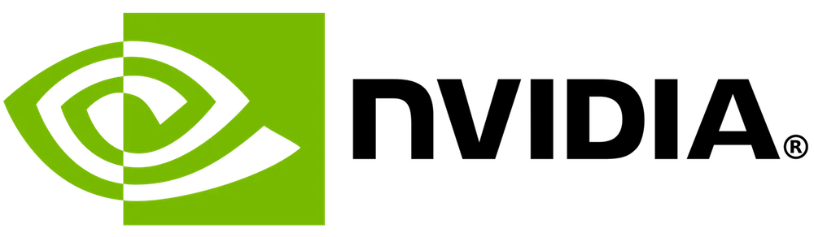
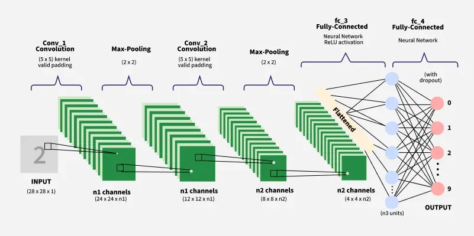
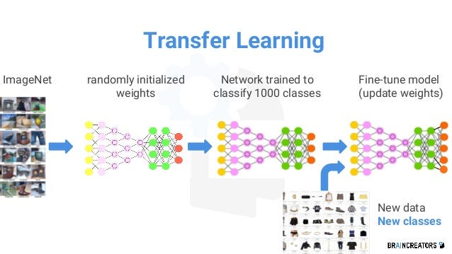
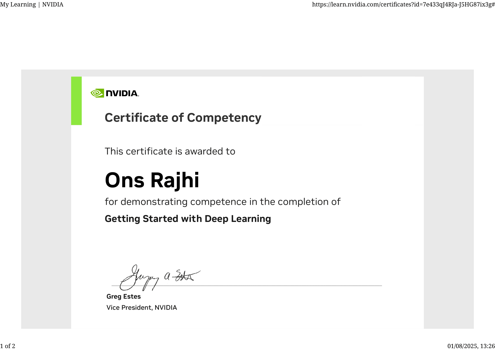
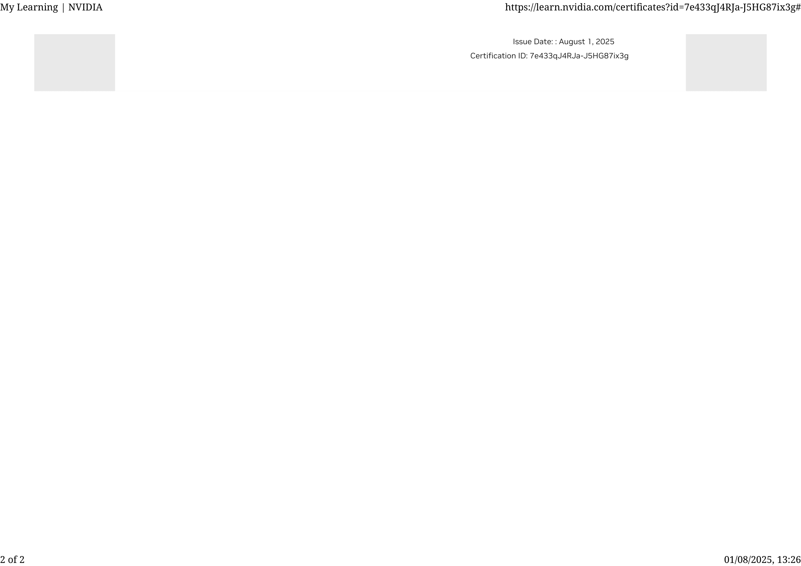

# Deep Learning Journey 🚀

This repository documents my hands-on journey through a transformative deep learning course. From image classification to natural language processing, I've tackled real-world problems using powerful tools and frameworks in AI.

## 📚 Course Overview

This course offered a structured pathway into deep learning through project-based learning:

### 🧠 Part 1: Image Classification & CNNs
- Datasets: MNIST, American Sign Language (ASL)
- Techniques:
  - Basic neural network models
  - Convolutional Neural Networks (CNNs)
  - Data augmentation
  - Model evaluation & optimization

### 🔄 Part 2: Transfer Learning & Deployment
- Pre-trained models (e.g., MobileNet, VGG, ResNet)
- Fine-tuning on custom datasets
- Achieving high accuracy with limited data
- Exporting models for production (e.g., `.h5`, `SavedModel`)
- Deployment in real-world environments

### 💬 Part 3: Natural Language Processing with BERT
- Tokenization and attention masks
- Text segmentation
- Building a Question-Answering system
- Introduction to Hugging Face Transformers
- Real-time inference with pre-trained BERT models

## 🛠️ Technologies Used# Fundamentals-of-Deep-Learning-by-NVIDIAA
This repository contains my notes, assignments, and projects from the Fundamentals of Deep Learning course offered by NVIDIA. This course provides a comprehensive introduction to the core concepts and practices in deep learning, aiming to equip participants with the foundational skills needed to develop and apply deep learning models effectively.
- Python
- TensorFlow 
- PyTorch
- Hugging Face Transformers
- Google Colab

## 🚀 Highlights
- Built and trained CNNs from scratch
- Applied transfer learning to real-world datasets
- Created a basic question-answering system using BERT
- Deployed trained models in practical use-cases

## 📈 Future Improvements
- Explore model interpretability with Grad-CAM and SHAP
- Extend NLP tasks to sentiment analysis and text summarization
- Integrate deployment with FastAPI or Gradio

## 🙌 Acknowledgements
Thanks to the instructors and open-source community for the tools, datasets, and support that made this journey possible.

---

**"This journey has deepened my passion for solving problems through AI — and it's only the beginning."**

